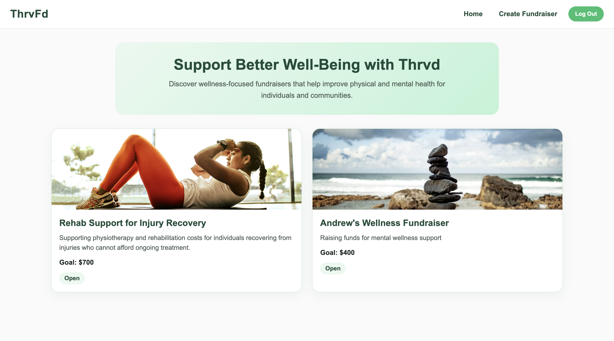
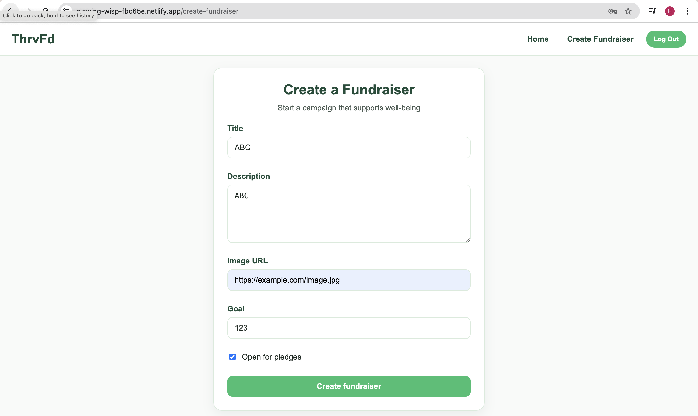
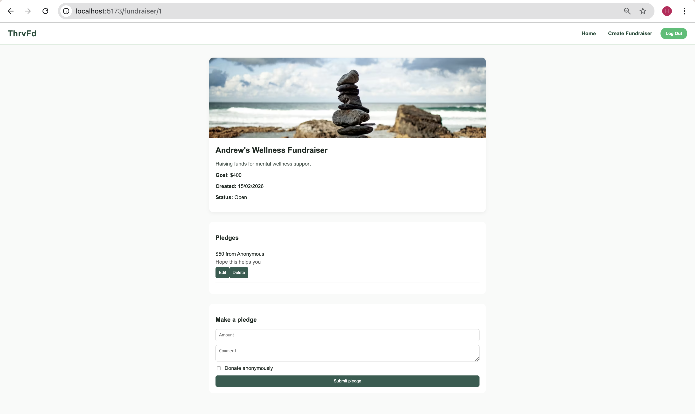

A link to the deployed project: 
   Front End: https://glowing-wisp-fbc65e.netlify.app/

 A screenshot of the homepage: 

 A screenshot of the fundraiser creation page/A screenshot of the fundraiser creation form: 

 A screenshot of a fundraiser with pledges: 

 A screenshot of the resulting page when an unauthorized user attempts to edit a fundraiser (optional, depending on whether or not this functionality makes sense in your app!): With users who arent the owners of any fundraiser, the editing button is automatically hidden

# React + Vite

This template provides a minimal setup to get React working in Vite with HMR and some ESLint rules.

Currently, two official plugins are available:

- [@vitejs/plugin-react](https://github.com/vitejs/vite-plugin-react/blob/main/packages/plugin-react) uses [Oxc](https://oxc.rs)
- [@vitejs/plugin-react-swc](https://github.com/vitejs/vite-plugin-react/blob/main/packages/plugin-react-swc) uses [SWC](https://swc.rs/)

## React Compiler

The React Compiler is not enabled on this template because of its impact on dev & build performances. To add it, see [this documentation](https://react.dev/learn/react-compiler/installation).

## Expanding the ESLint configuration

If you are developing a production application, we recommend using TypeScript with type-aware lint rules enabled. Check out the [TS template](https://github.com/vitejs/vite/tree/main/packages/create-vite/template-react-ts) for information on how to integrate TypeScript and [`typescript-eslint`](https://typescript-eslint.io) in your project.
